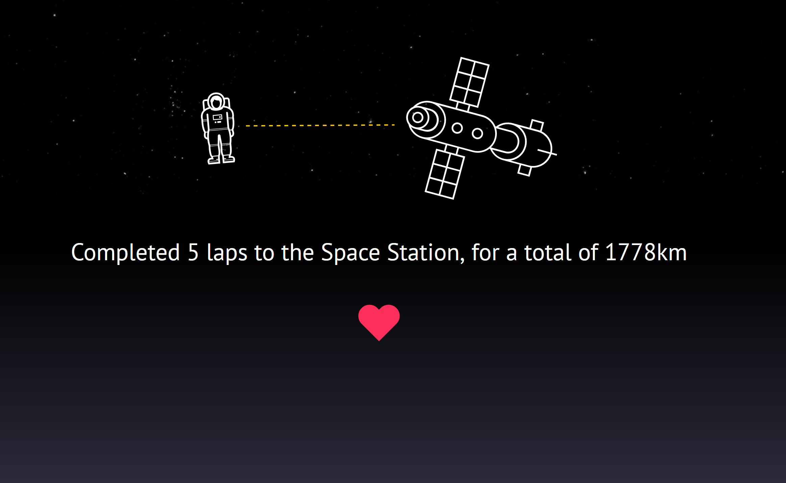
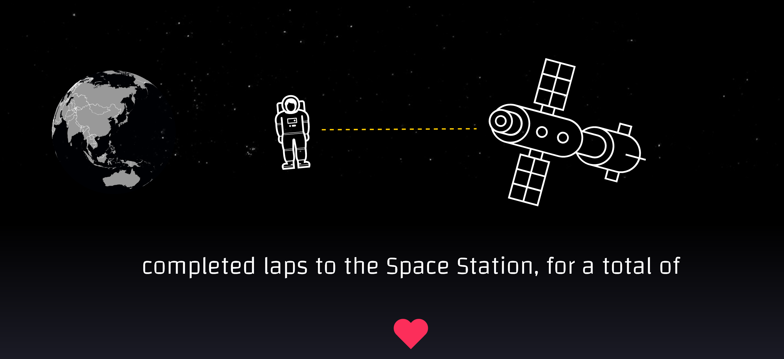

 

# step-to-space

A quick little website to track how many times I've covered a lap to/from the International Space Station in walking distance, with bonus real heart beat.

Uses the fitbit API :heart:

You can see it at: [steptospace.azurewebsites.net](http://steptospace.azurewebsites.net)

ISS trajectory data, Two line mean element set scraped from 

Earth SVG using d3.js and topology.js